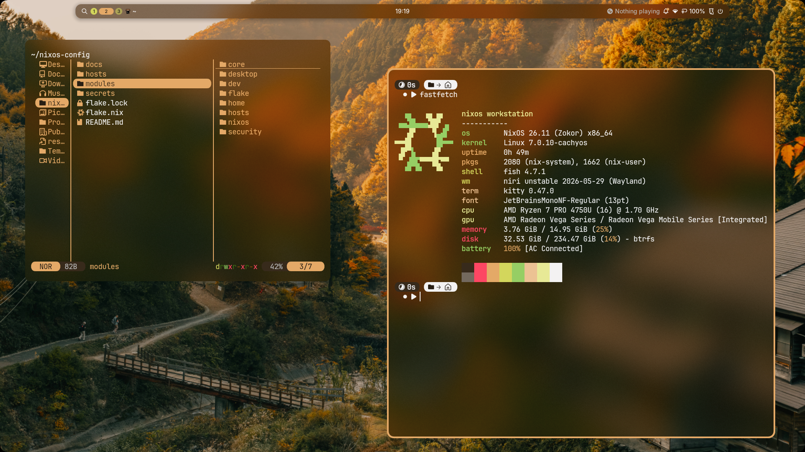

# NixOS Workstation

Personal NixOS config for a Niri desktop with Noctalia.



## What Is Here

```text
flake.nix             flake inputs and the import-tree entry point
modules/flake/        flake-parts outputs, checks, formatter, templates
modules/hosts/        host definitions and hardware config
modules/nixos/        system modules for boot, hardware, desktop, storage, dev tools
modules/home/shared/  shared Home Manager profile for the desktop and CLI
modules/home/admin/   admin account module
modules/home/v/       secondary user account module
templates/            project templates exposed by the flake
docs/                 workflow and template notes
secrets/              sops-nix notes, no plaintext secrets
```

The config uses a dendritic flake layout: files under `modules/` are imported by
`import-tree` and merge into shared module outputs such as
`flake.modules.nixos.workstation` and `flake.modules.homeManager.shared`.

## Daily Use

From the shell:

```sh
check
drybuild
rebuild
update
doctor
```

From the repo:

```sh
just check
just dry-build
just rebuild
just diff
just doctor
```

The Fish aliases live in `modules/home/shared/programs/fish.nix`. The repo
commands live in `Justfile`.

## Fresh Install

This host expects filesystem labels, not disk UUIDs:

```text
NIXBOOT  /boot, vfat
NIXROOT  / and /home, btrfs subvolumes @ and @home
```

Create the labels while formatting:

```sh
mkfs.vfat -n NIXBOOT <efi-partition>
mkfs.btrfs -L NIXROOT <root-partition>

mount /dev/disk/by-label/NIXROOT /mnt
btrfs subvolume create /mnt/@
btrfs subvolume create /mnt/@home
umount /mnt
```

Mount the target:

```sh
mount -o subvol=@,compress=zstd,noatime /dev/disk/by-label/NIXROOT /mnt
mkdir -p /mnt/home /mnt/boot
mount -o subvol=@home,compress=zstd,noatime /dev/disk/by-label/NIXROOT /mnt/home
mount /dev/disk/by-label/NIXBOOT /mnt/boot
```

Install:

```sh
sudo nixos-install --flake /mnt/path/to/nixos-config#nixos
```

`modules/hosts/nixos/hardware.nix` is intentionally generic. Put machine-local
changes such as swap, LUKS, kernel modules, or different labels in a private
branch rather than committing disk UUIDs here.

## Safe Rebuilds

Normal rebuild:

```sh
nix flake check --no-build path:$HOME/nixos-config
sudo nixos-rebuild switch --flake path:$HOME/nixos-config#nixos
```

When changing filesystems, labels, or mount options, build the next generation
for boot and reboot into it:

```sh
sudo nixos-rebuild boot --flake path:$HOME/nixos-config#nixos
sudo reboot
```

That avoids restarting active mounts such as `/home` inside the running session.

## Gated Features

- `workstation.secureBoot.enable` turns on Lanzaboote. Leave it disabled until
  Secure Boot keys exist under `/etc/secureboot`.
- `workstation.impermanence.enable` turns on impermanence. Leave it disabled
  until `/persist` exists and the persistence list covers the real state you use.
- `sops-nix` is wired to the host SSH key, but this repo does not commit
  encrypted secrets yet.

## Niri And Noctalia

Niri is enabled through `sodiboo/niri-flake`. The Home Manager config is split
into focused files under `modules/home/shared/desktop/niri/`:

```text
appearance.nix  raw KDL extras for Noctalia blur/backdrop integration
animations.nix  animation tuning and shaders
bindings.nix    keybindings
layout.nix      input and layout settings
rules.nix       window rules
startup.nix     compositor startup commands
```

Noctalia starts from Niri with `spawn-at-startup`. Keep a single startup path
unless there is a concrete reason to move to a systemd user service.

Noctalia has declarative config and runtime state:

- Declarative settings: `modules/home/shared/desktop/noctalia.nix`
- Runtime settings: `~/.local/state/noctalia/settings.toml`
- Wallpaper choice cache: `~/.cache/noctalia/wallpapers.json`

Before enabling impermanence, persist Noctalia state and the wallpaper directory:
`~/Pictures/Wallpapers`.

## Development

Use `mise` for per-project runtime versions:

```sh
mise use node@24
mise use bun@latest
mise use python@3.13
```

Use `direnv` with `nix-direnv` for Nix project shells:

```sh
echo "use flake" > .envrc
direnv allow
```

Project templates are exposed by the flake:

```sh
nix flake init -t path:$HOME/nixos-config#node
nix flake init -t path:$HOME/nixos-config#fullstack
nix flake init -t path:$HOME/nixos-config#nextjs
nix flake init -t path:$HOME/nixos-config#tanstack-start
```

More notes:

- `docs/desktop.md`: Niri, Noctalia, SDDM, portals, cursor handling.
- `docs/system.md`: boot, storage, Secure Boot, impermanence, secrets.
- `docs/dev-workflows.md`: daily development workflow.
- `docs/dev-templates.md`: project templates.

## Git Notes

Local flake evaluation only sees files tracked by Git when using `.#...`. After
adding an imported module, stage it before evaluating:

```sh
git add path/to/new-file.nix
```

For quick checks without staging, use an explicit path flake reference:

```sh
nix flake check --no-build path:$HOME/nixos-config
```
